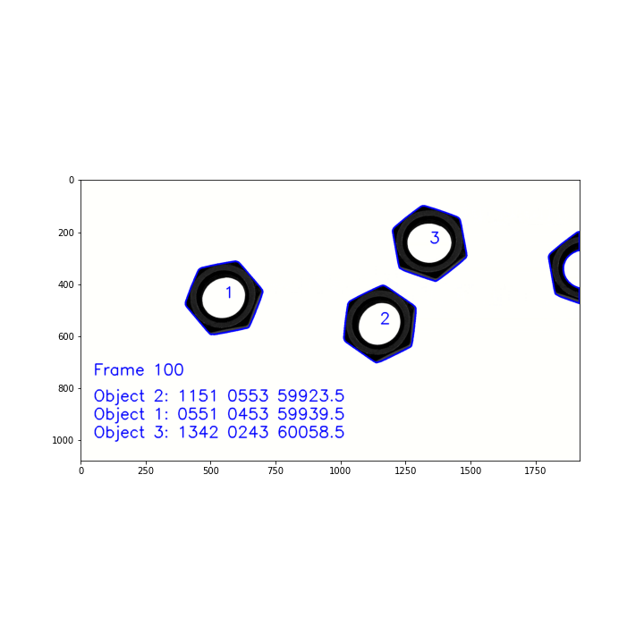

[](LICENSE)

> Notice: Following hyperlinks ***may not work sometimes*** due to error "Error 503 Backend is unhealthy" of nbviewer and I could not figure out a solution. Check the corresponding directories maually for the codes and pdfs.😅

> ***Applications*** section includes only a selected set of algorithms developed by me. You may go through the other directories(if you wish) to find out what is there. *Note that some of them may not complete.* 😁


<!--
### *Add Anaconda Prompt to the Windows right click context menu.*

1. Run regedit.exe (or type "Registry Editor" in windows search)
2. Navigate to `HKEY_CLASSES_ROOT > Directory > Background > shell`
3. Right click on the shell folder and add a new key named `AnacondaPrompt` and set its value to "Anaconda Prompt Here" (or anything you'd like it to appear as in the right click context menu)
4. Add a new key under this key, called `command`, and set its value to `cmd.exe /K C:\Users\ASUS\Anaconda3\Scripts\activate.bat` (may have to change the activate.bat file to where ever Anaconda is installed)
5. Go to the folder you want, right click and click "Anaconda Prompt Here".
6. That's it.
-->

<h2 align="center"> Contents❄ </h2>

1. [Creating a virtual environment for Computer Vision](#creating-a-virtual-environment-for-computer-vision)
2. [Editor Configurations](#editor-configurations)
3. [Applications](#applications)
4. [Assignments](#assignments)
5. [References](#references-)

---

# *Creating a virtual environment for Computer Vision*

Complete guide can be found [here](https://youtu.be/xE8w6OQzf8w)

Following steps describe only the creation of virtual environments.

1. Open command Prompt and follow the steps.

2. Change the Directory to: `C:\Python39`

3. Upgrade pip: `python -m pip install --upgrade pip`

4. Install `virtualenv` package: `python -m pip install virtualenv`

5. Create virtual environment: `virtualenv cv`

6. Change the directory to: `C:\Python39\cv\Scripts`

7. Activate the cv environment: `activate cv`

8. Then install the required packages

```shell
pip install numpy
pip install matplotlib
pip install opencv-python
pip install jupyterlab
```


# *Editor Configurations*

## *Using Jupyter Lab*

Environment created above can be activated in any folder through `GIT Bash` using the following commands.

```shell
$ source /c/Python39/cv/Scripts/activate
$ jupyter lab
```

## *Using Visual Studio Code*

### Extensions to be installed

* Jupyter Extension for Visual Studio Code
* TabNine Autocomplete AI: JavaScript, Python, TypeScript, PHP, C/C++, HTML/CSS, Go, Java, Ruby, C#, Rust, SQL, Bash, Kotlin, Julia, Lua, OCaml, Perl, Haskell, React

---
# *Applications*

|Figure|Desciption|
|:---:|:---|
||[Edge Detection- Laplacian of Gaussian kernel, Seperated Gradient(or Laplacian) and Gaussian Kerenels](https://nbviewer.jupyter.org/github/bimalka98/Computer-Vision-and-Image-Processing/blob/main/Applications/Edge%20Detection.ipynb)|
||[Smoothed Sobel Gradient and Laplacian for greater Sharpening of images with sensitive features](https://nbviewer.jupyter.org/github/bimalka98/Computer-Vision-and-Image-Processing/blob/main/Applications/Smoothed%20Sobel%20gradient%20and%20Laplacian%20for%20greater%20Sharpening.ipynb)|
||[Corner Detection Algorithm from Scratch: Using Scharr function for gradient and Corner Response function for detecting corners](https://nbviewer.jupyter.org/github/bimalka98/Computer-Vision-and-Image-Processing/blob/main/Applications/Corner%20Detection%20CRF.ipynb)|
||[Counting the rice grains in the rice image](https://nbviewer.jupyter.org/github/bimalka98/Computer-Vision-and-Image-Processing/blob/main/EN2550Assignments/A1/180631J_a01.ipynb#Part-2:-Count-the-rice-grains-in-the-rice-image)|
| | [Nearest Neighbor and Bi-linear Interpolation methods of Image Zooming](https://nbviewer.jupyter.org/github/bimalka98/Computer-Vision-and-Image-Processing/blob/main/EN2550Assignments/A1/part3.ipynb)|
| | [Normalized Direct Linear Transformation Method for Homography Calculation](https://nbviewer.jupyter.org/github/bimalka98/Computer-Vision-and-Image-Processing/blob/main/EN2550Assignments/A2/180631J_a02.ipynb#4.-Computing-the-Homogrpahy-Using-Mouse-Clicked-Points-without-OpenCV)|
| | [Camera Calibration of a Huawei Y5-2017 Back Camera Using a checkerboard and Camera Calibrator app in MATLAB](https://github.com/bimalka98/Computer-Vision-and-Image-Processing/tree/main/SINGLE%20VIEW%20GEOMETRY/Camera%20Calibration)|
| | [CIFAR10 Image Classifiers - Linear Classifier / Two-layer fully connected network / CNN](https://nbviewer.jupyter.org/github/bimalka98/Computer-Vision-and-Image-Processing/blob/main/EN2550Assignments/A4/180631J_a04.ipynb)|
| | [Object Counting on a Convey Belt - a Classical Machine Vision approach](https://nbviewer.jupyter.org/github/bimalka98/Computer-Vision-and-Image-Processing/blob/main/EN2550Assignments/A5/180631j_en2550_a05.ipynb)|


---

# *Assignments*

This section contains my solutions for assignments of the EN2550 Fundamentals of Image Processing and Machine Vision, a course at University of Moratuwa taught by [*Dr Ranga Rodrigo*](https://ranga.staff.uom.lk/).

1. EN2550 Assignment 1 [[PDF]](https://nbviewer.jupyter.org/github/bimalka98/Computer-Vision-and-Image-Processing/blob/main/EN2550Assignments/A1/LaTeX%20Report/180631J_a01.pdf), [[Code]](https://nbviewer.jupyter.org/github/bimalka98/Computer-Vision-and-Image-Processing/blob/main/EN2550Assignments/A1/180631J_a01.ipynb)
2. EN2550 Assignment 2 [[PDF]](https://nbviewer.jupyter.org/github/bimalka98/Computer-Vision-and-Image-Processing/blob/main/EN2550Assignments/A2/LaTeX%20Report/180631J_a02.pdf), [[Code]](https://nbviewer.jupyter.org/github/bimalka98/Computer-Vision-and-Image-Processing/blob/main/EN2550Assignments/A2/180631J_a02.ipynb)
3. N/A
4. EN2550 Assignment 4 [[PDF]](https://nbviewer.jupyter.org/github/bimalka98/Computer-Vision-and-Image-Processing/blob/main/EN2550Assignments/A4/LaTeX%20Report/180631J_a04.pdf), [[Code]](https://nbviewer.jupyter.org/github/bimalka98/Computer-Vision-and-Image-Processing/blob/main/EN2550Assignments/A4/180631J_a04.ipynb)
5. EN2550 Assignment 5 [[PDF]](https://nbviewer.jupyter.org/github/bimalka98/Computer-Vision-and-Image-Processing/blob/main/EN2550Assignments/A5/LaTeX%20Report/180631j_en2550_a05.pdf), [[Code]](https://nbviewer.jupyter.org/github/bimalka98/Computer-Vision-and-Image-Processing/blob/main/EN2550Assignments/A5/180631j_en2550_a05.ipynb)


---

## *References* 📌

1. UOM's EN2550 Fundamentals of Image Processing and Machine Vision: Lecture Notes and Lecture Videos [(on Youtube)](https://youtube.com/playlist?list=PLELEBz6g6MJanTKBAUJni8FTa8FC8gqGP) by [*Dr Ranga Rodrigo*](https://ranga.staff.uom.lk/)
2. Digital Image Processing(Third Edition) by *Rafael C. Gonzalez* and *Richard E. Woods*
3. Computer Vision Algorithms and Applications by *Richard Szeliski*
4. Multiple View Geometry in Computer Vision(Second Edition)  by *Richard Hartley* and *Andrew Zisserman*
5. [MatPlotLib Cheat Sheet](https://nbviewer.jupyter.org/github/bimalka98/Computer-Vision-and-Image-Processing/blob/main/matplotlib-cheatsheet.pdf)
